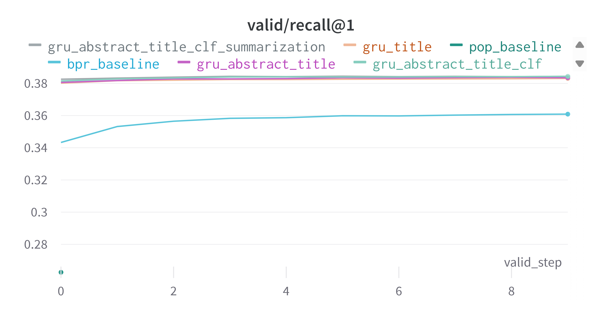

# Modern Approaches of Feed Ranking

* [Decription](#step1)
* [Setup](#step2)
* [Results](#step3)
* [Inferences](#step4)
* [Improvements](#step5)

<a name = "step1"></a>
## Description

You can find the final models weights [here](https://drive.google.com/drive/folders/1tWqxswPocbbu0TUTJfpdFDWpP-ojE8lH?usp=sharing) 
and wandb [here](https://wandb.ai/rho-corp/recbole?workspace=user-ras-unlucky).

<a name = "step2"></a>
# Setup
1. Open cmd (Win+R)
2. Clone the repository ([or download](https://github.com/addicted-by/feed-ranking/archive/refs/heads/main.zip))

```
git clone https://github.com/addicted-by/feed-ranking
```

4. Install requirements

```
pip install -r requirements.txt
```

3. Download data

```
python load_data --dataset mind_small
```

4. Run the experiment code

```
python experiments/sequential/gru4rec_extended.py
```

* To update the markdown table manually:

```
python update_markdown --log <log_path> --name <name of experiment>
```

<a name="step3"> </a>
## Results 

| Model | precision@1 | precision@5 | precision@10 | recall@1 | recall@5 | recall@10 | map@1 | map@5 | map@10 | ndcg@1 | ndcg@5 | ndcg@10 |
|           ---           |           ---           |           ---           |           ---           |           ---           |           ---           |           ---           |           ---           |           ---           |           ---           |           ---           |           ---           |           ---           |
|        Pop baseline        |        0.6007        |        0.3969        |        0.3031        |        0.2626        |        0.5421        |        0.6649        |        0.6007        |        0.542        |        0.5402        |        0.6007        |        0.6305        |        0.6535        |
|       BPR baseline       |       0.9156       |       0.6051       |       0.4503       |       0.3609       |       0.6852       |       0.8123       |       0.9156       |       0.8575       |       0.8416       |       0.9156       |       0.897       |       0.895       |
|  GRU baseline  |  0.9137  |  0.6177  |  0.4724  |  0.3686  |  0.6953  |  0.8303  |  0.9137  |  0.8702  |  0.867  |  0.9137  |  0.9111  |  0.9175  |
|      Exp 1.      |      0.9785      |      0.6753      |      0.5171      |      0.3831      |      0.7278      |      0.8647      |      0.9785      |      0.9611      |      0.9582      |      0.9785      |      0.9748      |      0.9758      |
|     Exp 2.     |     0.9812     |     0.6783     |     0.5192     |     0.3838     |     0.7295     |     0.8662     |     0.9812     |     0.9661     |     0.9628     |     0.9812     |     0.978     |     0.9786     |
|    Exp 3.    |    0.9841    |    0.6809    |    0.5212    |    0.3844    |    0.731    |    0.8677    |    0.9841    |    0.9703    |    0.9672    |    0.9841    |    0.9808    |    0.9812    |
|   Exp 4.   |   0.9849   |   0.6811   |   0.5215   |   0.3845   |   0.7311   |   0.8679   |   0.9849   |   0.9707   |   0.9676   |   0.9849   |   0.9811   |   0.9815   |


* <font color='orange'> Experiment 1 </font> Using title entities;
* <font color='purple'> Experiment 2 </font> Using abstract and title entities;
* <font color='#87cebf'> Experiment 3 </font> Using abstract, title entities, classification embeddings;
* <font color='gray'> Experiment 4 </font> Using abstract, title entities, classification and summarization embeddings.

### Only experiments
<p align="center">
  
</p>

### All launches
<p align="center">
  
</p>


<a name="step4"> </a>

## Inferences

TBD

## Improvements

TBD

---
## <font color="green">TODO List: </font>

[X] Logs parser

[X] Markdown tables with results

[X] Normal folders structure

[ ] Report

[ ] README

[ ] Exp3. Key-words abstract (Topic Modeling BERTopic)

[X] Exp4. Classification with BERT, obtain embeddings from the last layer and use it.

[X] Exp5. Summarization of abstract and obtain its embeddings.

[X] Wandb connection

[X] Baselines start

[X] Exp1. Title entities embeddings (mean of all entities): quality improved

[X] Exp2. Abstract entities embeddings (mean of all entities): quality improved